<div align="center">



</div>

# i build the instruments the stack doesn't ship with itself.

Inference serving internals and agent runtimes. Everything on this page is public, and every claim on it is one you can argue with.

`Python` · `Rust` · `TypeScript` · `CUDA` · GMT+5

---

## the shelf.

Every one of these exists because I needed it and couldn't buy it.

| | |
|---|---|
| **[vernier](https://github.com/Isk4R1oT/vernier)** · `Rust` | *For anyone whose agent passes CI and fails in production.* Records N runs at the model-API wire and names the **first divergent step**. Traces diverge on every run, so it fingerprints structure and treats prose as noise until it changes meaning.<br>`cargo install --git https://github.com/Isk4R1oT/vernier` |
| **[edp](https://github.com/Isk4R1oT/edp)** · `Python` | *Replaces "just put it in the system prompt and hope".* Explicit Decision Protocol — constraints and decisions re-injected every turn, so an agent can't quietly reverse a commitment it made twenty turns ago.<br>`pipx install git+https://github.com/Isk4R1oT/edp` |
| **[ctx](https://github.com/Isk4R1oT/ctx)** · `Rust` | *Replaces printing the prompt and squinting at it.* htop for LLM prompts — sits at the API boundary and x-rays the prompt your pipeline actually assembled, token budget and all.<br>`cargo install --git https://github.com/Isk4R1oT/ctx` |
| **[vecdoctor](https://github.com/Isk4R1oT/vecdoctor)** · `Rust` | *For a RAG that got worse and nobody knows when.* `EXPLAIN ANALYZE` for your vector store — drift, index-model mismatch, embedding health. Store-agnostic, one static binary, zero config.<br>`cargo install --git https://github.com/Isk4R1oT/vecdoctor` |
| **[claude-quant](https://github.com/Isk4R1oT/claude-quant)** · `Python` | *A full agent system you can read end to end.* The desk in fig. 02 below: orchestrator, subagent fan-out, price-ladder routing, sandboxed code-execution-as-tool, edp injected every turn. |
| **assay · mcpgen · plinth** | An eval harness built to be hard to game; a production MCP server generated from any API; host, meter and bill black-box agents. [Twelve more on the shelf.](https://github.com/Isk4R1oT?tab=repositories) |

### thirty seconds

Don't take the figures on faith. Point vernier at a suite you already have and watch it name the step where two identical runs stopped agreeing.

```console
$ cargo install --git https://github.com/Isk4R1oT/vernier
$ vernier run --n 20 -- pytest agent_suite.py

first divergence · run 7 vs run 3 · step 14
tool=search_index   args.k   8 → 12
```

---

## claude-quant, one unattended session

<div align="center">



</div>

Four acts on four instruments, four market situations, four different formulas — and four different decisions, including one refusal and one loss. Every position traces to a `DEC` carrying the proof that produced its size; a position with no `DEC` cannot exist.

---

## positions i'd defend

<sub>Argue with any line.</sub>

### serving & inference

**01** — I benchmark at the batch sizes I'll actually serve and never interpolate between them. Nothing measured below the knee predicts what's above it.

**02** — Routing on longest prefix match is a scheduling decision before it's a memory one. It concentrates traffic on whichever node holds the hot KV, so the router needs a cap and the KV needs somewhere to spill.

**03** — Speculative decoding has no single speedup number. The accept rate moves with the prompt and with the load, so I report the distribution or I don't report it.

**04** — Quantization is only free if you measured what it broke. I gate on perplexity drift in the domain I'm serving, not on an average — the mean is exactly what hides the weights that carry the loss.

**05** — The cheapest throughput I've ever bought came from the scheduler, not the kernel. I find out which side of the roofline I'm on before I write CUDA.

**06** — "Same seed, temperature 0" isn't reproducible unless batch composition is pinned too. Batching changes reduction order.

**07** — A GPU is a budget line, not a resource. Small models that idle — embedder, reranker — should share a card, and knowing when they can is often what makes self-hosting add up at all.

### agent runtimes

**01** — Decision drift is the first failure mode of a long-running agent, and it isn't forgetting: the agent confidently contradicts itself.

**02** — An agent that can't refuse itself isn't safe to leave running. The constraint has to be able to kill the trade the same agent just proposed.

**03** — A number an agent acts on should be one it computed in a sandbox, not one it asserted in prose. Code execution is a reasoning primitive, not a feature.

**04** — Tool arguments get schema-validated before dispatch, never after the exception, and the smoke test runs fail-closed against mocks so the verdict lands before any network egress.

**05** — Anything read through a tool is data and never acquires instruction privileges. The sandbox is for the mistakes already in the input, not only for an attacker.

**06** — Long-horizon memory is an eviction policy wearing the costume of a database. I write the eviction rule before I pick the store.

**07** — A model upgrade is a regression event until frozen golden tasks are replayed against mocked tools and diffed. Retrieval gets the same treatment: chunking, HyDE, hybrid multi-query with RRF and a cross-encoder rerank each have to earn their place on the golden set.

---

## the stack.

In **dark**: what I've shipped with. In plain text: what I reach for when it fits.

| | |
|---|---|
| **serving & inference** | **SGLang** *(RadixAttention, continuous batching)* · **vLLM** *(PagedAttention, chunked prefill, scheduler tuning)* · **disaggregated prefill/decode** · **cache-aware routing** · **hierarchical KV offload** · **GPTQ / AWQ / INT8 / FP8** · **speculative decoding** *(n-gram, EAGLE)* · **tensor & expert parallelism** · FlashAttention · Triton · torch.compile / CUDA graphs · Nsight |
| **agents & tooling** | **Claude Agent SDK** · **LangGraph** · **MCP / FastMCP** · **PydanticAI** · **meta-agents** · **supervisor & fan-out orchestration** · **multi-model routing** · **schema-aware tool validation** · **code-execution-as-tool** · **agent-as-code** · **hooks & lifecycle events** · CrewAI · AutoGen · ReAct · DSPy |
| **long-horizon & memory** | **decision persistence** *(own protocol — edp)* · **context-window compaction** · **embedding-cached memory store** · **rolling summaries** · **multi-session continuity** · **checkpointing across days** |
| **retrieval** | **contextual chunking** · **HyDE** · **hybrid multi-query with RRF** · **cross-encoder rerank** · **RAG verifier** · **pgvector** *(HALFVEC / HNSW)* · **Qdrant** · FAISS · LlamaIndex |
| **evaluation** | **calibrated LLM-as-judge** · **pairwise Bradley-Terry MLE** · **judge stability across shuffles & temperatures** · **frozen golden tasks** · **drift detection** · **auto-eval with tool mocks** · DeepEval · G-Eval |
| **security & isolation** | **prompt-injection & jailbreak detection** · **input / output guardrails** · **sandbox isolation** *(seccomp / gVisor-style)* · **capability scopes** · **reversible PII tokenization** at the model↔tool boundary |
| **infra & reliability** | **Kubernetes-native serving** · **KEDA** *(SLO autoscale, scale-to-zero)* · **Docker** · **CI/CD** · **SLO / SLI, p95 / p99** · **admission control** · **on-call & runbooks** · **OpenTelemetry** · Langfuse · LangSmith · MLflow · Airflow |
| **data & hardware** | **PostgreSQL + pgvector** · **ClickHouse** · **Redis** · **S3 / R2** · **FastAPI** · **A100 80GB** · **L40S** · **T4** · MongoDB · AWS · GCP · Cloudflare Workers |
| **classic ML · DL · CV · NLP** | **PyTorch** · **fine-tuning** *(PEFT / QLoRA / DPO)* · **knowledge distillation** · **NER & embeddings** · **classification & scoring** · **forecasting** · **anomaly / fraud** · scikit-learn · CatBoost / XGBoost / LightGBM · detection & recognition |

---

## what a number has to survive

Before I believe a result of mine, it clears four things:

- **load tested** at matched concurrency against a naive baseline;
- **judged** by a rubric calibrated on human reference, and always paired against the pre-change run;
- **costed** per 1M tokens at matched quality, with break-even against real load;
- **scored** on a golden set that predates the change it judges.

Tell me the standard you hold and I'll bring numbers that meet it.

---

<sub>GMT+5 · happy to argue about any line above · <a href="https://t.me/Ig0Ro4">telegram</a> · <a href="https://github.com/Isk4R1oT?tab=repositories">all repos</a></sub>
