I work across the whole AI stack — serving and inference internals, agent runtimes and orchestration, evaluation and tracing, and the backend and interface that make any of it usable. I take the whole thing, not one layer of it.

Everything below is something I needed and couldn't buy. Most of them are instruments: they measure a part of the stack nobody else is looking at.

 

<h3>The instruments</h3>

<table>
<tr>
<td width="50%" valign="top">

#### [vernier](https://github.com/Isk4R1oT/vernier) · `Rust`
A differential instrument for non-deterministic agents. Records N runs at the model-API wire, fingerprints the variance one run hides, and names the **first divergent step**.

</td>
<td width="50%" valign="top">

#### [ctx](https://github.com/Isk4R1oT/ctx) · `Rust`
*htop for LLM prompts.* Transparent proxy at the LLM-API boundary that x-rays the prompt a pipeline **actually** assembled — not the one you think it did.

</td>
</tr>
<tr>
<td width="50%" valign="top">

#### [edp](https://github.com/Isk4R1oT/edp) · `Python`
**Explicit Decision Protocol.** Agents make decisions and then quietly contradict them. This makes the decision a first-class object the agent has to remember and respect.

</td>
<td width="50%" valign="top">

#### [vecdoctor](https://github.com/Isk4R1oT/vecdoctor) · `Rust`
`EXPLAIN ANALYZE` for your vector store. Store-agnostic embeddings health, drift detection, index-model mismatch diagnosis. Single static binary, zero config.

</td>
</tr>
<tr>
<td width="50%" valign="top">

#### [claude-quant](https://github.com/Isk4R1oT/claude-quant) · `Python`
A full agentic system, not a demo: Agent SDK orchestrator with multi-model subagent fan-out, six trading skills, prompt caching and persistent memory, wired to live perpetuals.

</td>
<td width="50%" valign="top">

#### [Plinth](https://github.com/Isk4R1oT/Plinth) · `TypeScript`
Marketplace for hosted AI agents — host, proxy, meter and bill black-box `/invoke` agents. Runtime, billing and product surface, all of it mine.

</td>
</tr>
</table>

MCP servers, Claude Code plugins, eval harnesses and inference tooling —
<a href="https://github.com/Isk4R1oT?tab=repositories">the rest of the shelf</a>.

 

<h3>The other half of the stack</h3>

The plates above are the serving layer. This is what I build on top of it — runtime, memory, isolation, orchestration.

 

<h3>Every plate, on demand</h3>

The heroes above play on their own. If you would rather pick, open one.

<b>Serving stack</b> — 11 plates, open any of them

 

Schematics of mechanisms, plus three plates carrying my own measurements.

<code>01</code> &nbsp; <b>THE ROOFLINE</b> — the regime is set by batch size, not by model size

 

<code>02</code> &nbsp; <b>A TENSOR CORE, MOSTLY DARK</b> — speculation is free because the silicon was already idle

 

<code>03</code> &nbsp; <b>THE KNEE</b> — nothing measured below the knee predicts what is above it

 

<code>04</code> &nbsp; <b>THE BOUNDARY</b> — disaggregation pays in the middle of the curve, and only there

 

<code>05</code> &nbsp; <b>THE CACHE THAT FILLS ITSELF</b> — prefix match alone queues the hottest node

 

<code>06</code> &nbsp; <b>EXPERT ROUTING · DISPATCH / COMBINE</b> — the router convention differs by model and fails silently

 

<code>07</code> &nbsp; <b>A HAND-WRITTEN KERNEL vs cuBLAS</b> — the last stretch costs as much as everything before it

 

<code>08</code> &nbsp; <b>SAME SEED · STILL DIVERGES</b> — batch composition changes the order of reductions

 

<code>09</code> &nbsp; <b>THE WEIGHT YOU CANNOT TOUCH</b> — super weights are not magnitude outliers

 

<code>10</code> &nbsp; <b>WHEN ATTENTION GOES MEMORY-BOUND</b> — prefill is compute-bound only while the context is short

 

<code>11</code> &nbsp; <b>COLD START IS A MEMORY PROBLEM</b> — a memory constraint wearing a latency costume

 

<b>Agent runtime</b> — 12 plates, open any of them

 

How I keep long-running agents honest, isolated and cheap.

<code>01</code> &nbsp; <b>DECISION DRIFT</b> — the agent does not forget — it confidently contradicts itself

 

<code>02</code> &nbsp; <b>CONTEXT COMPACTION</b> — the loss never shows up on the turn you made it

 

<code>03</code> &nbsp; <b>THE META-AGENT</b> — a platform is judged on how cheap the second agent is

 

<code>04</code> &nbsp; <b>LONG-HORIZON MEMORY</b> — memory is an eviction policy wearing the costume of a database

 

<code>05</code> &nbsp; <b>THE AGENT THAT PROVES ITS OWN MATH</b> — it has to demonstrate the number before it may act on it

 

<code>06</code> &nbsp; <b>THE PII MEMBRANE</b> — the model never needed the real value to reason

 

<code>07</code> &nbsp; <b>TOOL CALLS · VALIDATED BEFORE DISPATCH</b> — 90 % valid is a system that breaks every ten turns

 

<code>08</code> &nbsp; <b>CODE EXECUTION, FENCED</b> — the sandbox is for the mistakes sitting in the input

 

<code>09</code> &nbsp; <b>WHERE THE TRUST BOUNDARY ACTUALLY IS</b> — data read through a tool does not get to give orders

 

<code>10</code> &nbsp; <b>CAPABILITY FAN-OUT</b> — routing by capability beats a better prompt

 

<code>11</code> &nbsp; <b>THE SNAPSHOT WAS ALREADY OLD</b> — the page stopped existing while the model was thinking

 

<code>12</code> &nbsp; <b>GOLDEN TASKS · FROZEN, MOCKED, REPLAYED</b> — a model upgrade is a regression event until proven otherwise

 

 

<h3>Stack</h3>

 

 

 

 

<h3>Signal</h3>

  

<picture>
  <source media="(prefers-color-scheme: dark)" srcset="https://raw.githubusercontent.com/Isk4R1oT/Isk4R1oT/output/github-snake-dark.svg">
  <source media="(prefers-color-scheme: light)" srcset="https://raw.githubusercontent.com/Isk4R1oT/Isk4R1oT/output/github-snake.svg">
  
</picture>

 

<h3>Reach</h3>

GMT+5 · open to interesting roles, contracts and audits

Real name in interviews: Igor Afonin.

